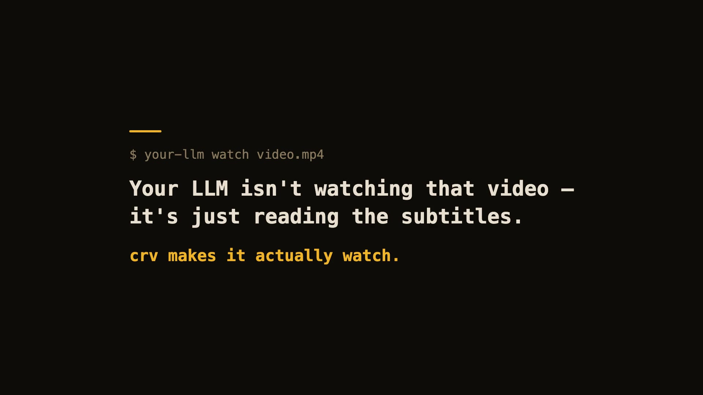

# claude-real-video

[](https://pypi.org/project/claude-real-video/) [](https://pypi.org/project/claude-real-video/) [](LICENSE) [](https://news.ycombinator.com/item?id=48766005)

[](https://github.com/HUANGCHIHHUNGLeo/claude-real-video/releases/download/v0.7.15/crv-demo-60s.mp4)

60-second real demo — real install, real run, real viewer.

**Let Claude — or any LLM — actually watch a video.**

```bash
pip install "claude-real-video[whisper]"
npx skills add HUANGCHIHHUNGLeo/claude-real-video   # one command, installs the skill into Claude Code, Cursor, Codex, Copilot, Gemini CLI & 50+ agent hosts
```

Then paste a video link into your agent and ask about it. (CLI-only use? `crv "<url>"` works with just the pip install.)

> **Naming:** crv is the short name for claude-real-video (the PyPI package). The paid add-on, **crv Pro**, is sold on Capafy under the listing name "llm-real-video Pro".


> Same 58-second clip: fixed 1 fps sampling = **58 frames**. crv keeps the **26 that actually differ** — and `--grid` packs them into **3 contact sheets**. Fewer tokens, nothing missed.

> **This free version lets your AI *see* the video.** [crv Pro](https://leoaido.com/crv-pro/) lets it *understand* it — how it was shot (cut rhythm, camera moves) plus a timestamped timeline of what frames can't show: gestures, expressions, voice pitch shifts, emotion, sound events. One-time founder price $19 through July 31 ($29 from August 1) — [get it on Capafy](https://capafy.ai/agent/llm-real-video-pro-let-any-llm-watch-videos/5451082151) or [buy with card via Lemon Squeezy](https://leoaido.lemonsqueezy.com/checkout/buy/ff552000-adc0-49f1-8eec-5e8ada1905a1).

Most AI tools don't really *see* a video. Paste a YouTube link into ChatGPT and it
reads the **transcript**, not the picture. Claude won't take a video file at all.
Even Gemini, which *can* read video natively, has to send it up to Google and
samples frames at a **fixed interval** (1 fps by default), so fast cuts slip past.

`claude-real-video` does it differently, and **the processing runs locally**: point it at a URL or a
file, and it pulls the frames that *actually matter* (every scene change, not a
fixed quota), throws away the near-duplicates, transcribes the audio, and hands
you a clean folder any LLM can read. All the processing happens on your own machine — what gets sent anywhere is only the frames/text *you* choose to paste into an LLM afterwards.

```bash
crv "https://www.youtube.com/watch?v=..."
# → crv-out/frames/*.jpg  +  frames.json (per-frame timestamps)  +  transcript.txt/.json  +  MANIFEST.txt
```

Then drop the frames + `MANIFEST.txt` into Claude / ChatGPT / Gemini and ask away.

**No terminal needed** — run `crv-web` and a local page opens (Traditional Chinese / Simplified Chinese / English): paste a YouTube or Reels link or a file path, click Analyze, open the result viewer. Video analysis and output generation run on your machine — the source video never gets uploaded. (If you then paste the extracted frames or transcript into a cloud LLM, that data goes to that provider.)

Want to eyeball what the model will see first? Add `--viewer` — it writes a local `viewer.html` (video + keyframe grid + transcript) you can double-click open. No network, no extra installs.

**Slow-changing content** (animation tutorials, gradual morphs, slow pans): add `--adaptive` — frames are picked against their rolling neighbourhood instead of a fixed threshold, so a 2-3s squash-and-stretch that never spikes any single frame still gets captured.

**Text-heavy content** (lecture slides, screen recordings, talking-head explainers): add `--text-anchors` — extra frames are forced at subtitle-cue timestamps, so each spoken segment gets a matching visual even when the scene barely changes. Needs a sidecar `.srt`/`.vtt` or an embedded subtitle track — captions burned into the pixels can't be detected. At most one forced frame per second; scene detection is untouched.

**Multi-speaker content** (interviews, podcasts, meetings): add `--speakers` — every transcript line gets a speaker label (`[SPEAKER_00]`, `[SPEAKER_01]`, …) so the model can follow who said what. Runs a local diarization model (45 MB, downloads once, no account or token needed). Install with `pip install "claude-real-video[speakers]"`.

Not doing LLM work? It also works as a **general-purpose video keyframe extractor** —
scene-change detection + dedup, no ML models to download.

**Using Claude Code — or any coding agent?** One command installs the skill
(works with Claude Code, Cursor, Codex, Copilot, Gemini CLI and other
[agentskills.io](https://agentskills.io)-compatible hosts):

```bash
pip install "claude-real-video[whisper]"
npx skills add HUANGCHIHHUNGLeo/claude-real-video
```

Then just paste a video link into your agent and ask about it.

<details>
<summary>Manual install (clone + copy)</summary>

```bash
git clone https://github.com/HUANGCHIHHUNGLeo/claude-real-video.git
mkdir -p ~/.claude/skills && cp -r claude-real-video/skills/claude-real-video ~/.claude/skills/
```

</details>

**New in 0.3.0** — tell it *why* you're watching, and keep what it finds:

```bash
crv "https://youtu.be/..." --why "find the pricing strategy" --kb ~/notes
```

`--why` makes the analysis focus on what you care about instead of a generic summary;
`--kb` saves the result as a dated note in your own notes folder, so it doesn't die in `crv-out`.

---

## Why not just sample frames?

Most "let an LLM watch a video" scripts (and Gemini's own pipeline) grab frames
at a **fixed interval** — e.g. one per second. That over-samples a static
screencast and under-samples a fast-cut reel. `claude-real-video` is smarter:

| | fixed-interval sampling | **claude-real-video** |
|---|---|---|
| Frame selection | every N seconds | **scene-change detection** + density floor |
| Repeated shots (A-B-A cuts) | sent again every time | **sliding-window dedup** sends each shot once |
| Static slide (10 min) | ~600 near-identical frames | **collapses to 1** (dedup) |
| Fast-cut reel | misses frames between samples | catches each visual change |
| Audio | often ignored | Whisper transcript w/ language detect |
| Where the processing happens | often in someone's cloud | **on your machine** (you choose what to share with an LLM afterwards) |
| Input | usually local file only | **URL (yt-dlp) or local file** |

You feed the model *fewer, more meaningful* frames — cheaper context, better
understanding.

---

## Install

```bash
pip install "claude-real-video[whisper]"   # recommended: frames + dedup + audio transcription
pip install claude-real-video              # core only (frames + dedup)
```

pip extras never install themselves — without `[whisper]` there is **no speech-to-text**
(videos that ship their own subtitles still get a transcript).

### System requirement: ffmpeg

`ffmpeg` / `ffprobe` are used for frame extraction and audio, and aren't
pip-installable. Install them once:

| OS | command |
|---|---|
| **macOS** | `brew install ffmpeg` |
| **Linux** | `sudo apt install ffmpeg` (or your distro's package manager) |
| **Windows** | `winget install Gyan.FFmpeg` — or `choco install ffmpeg` — or [download a build](https://www.gyan.dev/ffmpeg/builds/) and add its `bin\` folder to your `PATH` |

Verify it's on your `PATH`:

```bash
ffmpeg -version
```

Transcription uses the `whisper` CLI (installed by the `[whisper]` extra, or
`pip install openai-whisper`). Whisper also relies on ffmpeg.

**Faster + hallucination-proof transcripts (recommended):** install the `[fast]`
extra and crv automatically switches to
[faster-whisper](https://github.com/SYSTRAN/faster-whisper) — same models, same
output files, several times faster, and gated by Silero VAD (voice-activity
detection): music-only or silent audio yields an honest "no speech" note instead
of whisper's classic invented caption. No new flags to learn:

```bash
pip install 'claude-real-video[fast]'
```

If both are installed, faster-whisper wins; if it ever fails, crv falls back
to the `whisper` CLI on its own.

Works on **macOS, Windows, and Linux** — Python 3.10+.

---

## Usage

```bash
# A YouTube / Instagram / TikTok / ... link
crv "https://www.instagram.com/reel/XXXX/"

# A local file, English transcript, output to ./out
crv lecture.mp4 -o out --lang en

# Frames only, no transcription
crv clip.mp4 --no-transcribe

# A login-gated video (your own / authorised use): pass a Netscape cookie file
crv "https://..." --cookies cookies.txt
```

`python -m claude_real_video ...` works as an alias for `crv` too.

### Options

| flag | default | meaning |
|---|---|---|
| `-o, --out` | `crv-out` | output directory |
| `--overwrite` | off | replace a previous analysis living in the output directory (without this, a non-empty output dir is refused to avoid mixing videos) |
| `--scene` | `0.30` | scene-change sensitivity (lower = more frames) |
| `--fps-floor` | `1.0` | at least one frame every N seconds |
| `--max-frames` | `150` | hard cap on total frames |
| `--adaptive` | off | adaptive scene detection: catches slow morphs (2-3s squash/stretch, gradual pans) a fixed threshold misses, by comparing each frame against its rolling neighbourhood |
| `--text-anchors` | off | force extra frames at subtitle-cue timestamps (sidecar `.srt`/`.vtt` or embedded track) — for videos where meaning changes faster than pixels; at most one forced frame per second |
| `--speakers` | off | label every transcript line with the speaker (`[SPEAKER_00]` …) via local diarization — needs `pip install "claude-real-video[speakers]"`, 45 MB model downloads once |
| `--lang` | `auto` | Whisper language (`en`, `zh`, `auto`, ...) |
| `--whisper-model` | `base` | Whisper model for transcription (`tiny`/`base`/`small`/`medium`/`large`/`turbo` — base is fast; **want sharper transcripts? `--whisper-model turbo` is one flag away**: close to large-v2 accuracy at ~8x the speed, one-time 1.6GB download, ~6GB memory) |
| `--dedup-threshold` | `8` | % of pixels that must change for a frame to count as new; higher = fewer frames (the settled-local detector's gate scales with it too) |
| `--dedup-window` | `4` | compare against the last N kept frames — a shot the model already saw doesn't come back after a cutaway (`1` = consecutive-only) |
| `--report` | off | keep dropped frames in `./dropped` + write `report.html` visualising every keep/drop decision |
| `--no-transcribe` | off | skip audio |
| `--keep-audio` | off | also save the **full soundtrack** (`audio.m4a`) so audio models can *hear* it |
| `--viewer` | off | also write `viewer.html` — browse the video, keyframes and transcript in one local page (double-click to open) |
| `--grid` | off | also tile the kept frames into 3x3 contact sheets (`./grids`) — consecutive frames side by side help the model follow motion and progression |
| `--why` | – | why you're watching, e.g. `--why "find the pricing strategy"` — written into `MANIFEST.txt` so the model analyses with that lens instead of a generic summary |
| `--kb` | – | also save the analysis as a dated markdown note into this folder (your Obsidian vault, notes dir, ...) — so it joins your knowledge base instead of dying in `crv-out` |
| `--cookies` | – | Netscape cookie file for login-gated sources |
| `--cookies-from-browser` | – | read login cookies straight from your own browser — `chrome`, `safari`, `firefox` or `edge` (your own account only) |

---

### What `--grid` output looks like

One contact sheet = nine consecutive keyframes, in order, filenames on each cell — the model reads a sequence, not scattered stills:


## Use it from Python

```python
from claude_real_video import process

r = process("https://youtu.be/...", "out", lang="en")
print(r.frame_count, r.transcript_path)
```

---

## How it works

1. **Fetch** — `yt-dlp` for URLs (optional cookies), or copy a local file.
2. **Extract** — one chronological `ffmpeg select` pass grabs every scene change
   *plus* a density floor (at least one frame every `--fps-floor` seconds), so
   fast cuts and slow screencasts are both covered.
3. **Dedup** — two detectors against a **sliding window** of the last
   `--dedup-window` kept frames, so an A-B-A cutaway doesn't re-send a shot the
   model has already seen. A *global* channel measures real pixel difference
   (downscaled RGB, not a perceptual hash — hashes go blind on flat colours and
   equal-luma hue changes); `--dedup-threshold` is the % of it that must change.
   A *settled-local* channel (v0.7.4) catches what the global one can't see:
   thin pen strokes, caption/text-card swaps and small UI updates that average
   out to ~0% globally. It looks, on a finer signature, for a region that
   differs strongly from every recent kept frame (with 1px shift tolerance, so
   film grain and frame jitter don't trigger) *and* is no longer changing — a
   settled new state, not motion mid-flight — with a cooldown so continuous
   motion that pauses every second (a waving flag, drifting smoke) can't keep
   re-firing. The final frame is evaluated even if still in motion (so a video's closing state is never lost), but it must clear both contrast gates like any other frame. `--report` writes `report.html` showing every keep/drop decision
   with its diff % (settled-local keeps are labelled), for tuning.
4. **Text** — if the video **already has subtitles** (a sidecar `.srt`/`.vtt` next to a
   local file, or an embedded subtitle track), those are used as the transcript —
   faster and more accurate than re-transcribing. Only when there are no subtitles
   does it fall back to **Whisper** on the audio (skipped cleanly if there's no audio).
5. **Audio** *(optional, `--keep-audio`)* — save the **full original soundtrack**
   (`audio.m4a`: music + speech + effects, copied losslessly when possible). The
   transcript only has the *words*; the audio file lets a model that can listen
   (Gemini, GPT-4o, …) actually *hear* the music and tone.
6. **Timestamps** — every kept frame's source-video time survives the whole
   pipeline (extraction → dedup → `--max-frames` thinning → renaming) and is
   written to `frames.json` (`file` / `timestamp_sec` / `timestamp` /
   `selection_reason`). Cite visual evidence as `frame_012 @ 00:03:41`, align
   frames with `transcript.json` segments, or feed the map to a video-RAG
   pipeline. In `viewer.html`, click any keyframe → "play video from here".
7. **Manifest** — `MANIFEST.txt` summarises everything for the model.

So the model can **see** (key frames), **read** (transcript) and — with `--keep-audio` —
**hear** (full soundtrack) the video. The transcript is plain text any model can read;
the tool **doesn't burn subtitles into the video** — burning is a presentation choice,
not something needed to make a video AI-readable.

---

## Notes

- Only download content you have the right to. The `--cookies` option is for
  your own, authorised access — don't ship credentials in a repo.
- Use one output folder per video. Re-running into a folder that already holds
  an analysis is refused (so two videos never mix); pass `--overwrite` to replace it.

## crv Pro — understand *how* a video was shot

The free tool gives your AI keyframes and a transcript — enough to know **what** a video is about. **crv Pro adds everything else: how it's shot, how it's cut, how it's spoken, what it feels like.** All computed on your machine, written as plain text any LLM can read.

- **Camera & pacing (`--motion`)** — every shot auto-labelled: static, pan, tilt, zoom, handheld. Full shot table: per-shot duration, cuts per minute, pacing across open/middle/close. High-motion shots get 0.2s-apart burst frames.
- **Sound & emotion (`--senses`)** — voice emotion, tone curves and audio events (laughter, SFX, ambience) timestamped segment by segment. Vocals and music auto-separated: emotion reads the clean voice, music gets its own BPM + energy track. No-dialogue footage (MVs, film) falls back to reading mood from color and light.
- **Interactive viewer (`--viewer`)** — one self-contained web page per analysis: the video, a clickable event timeline that jumps to the second, a transcript that highlights along with playback. EN / 繁中 / 简中.
- **Two reports, one flag (`--ai-report`)** — with your own API key: one report on how it's shot, one on what it says.
- **Breakdown report (`--breakdown`)** — hook analysis, pacing curve, camera language, and a rubric your own LLM completes into a full teardown.

One-time founder price **$19** through July 31 — **$29** from August 1:

- **Buy on Capafy** (instant download, license key included): https://capafy.ai/agent/llm-real-video-pro-let-any-llm-watch-videos/5451082151
- **Buy with credit card** (Lemon Squeezy checkout, instant download): https://leoaido.lemonsqueezy.com/checkout/buy/ff552000-adc0-49f1-8eec-5e8ada1905a1
- Product page & demo: https://leoaido.com/crv-pro/

---

**Following the build?** I'm documenting the road from open-source tool to first paying customer, in public — [@LeoAidoAI on X](https://x.com/LeoAidoAI).

## License

MIT
